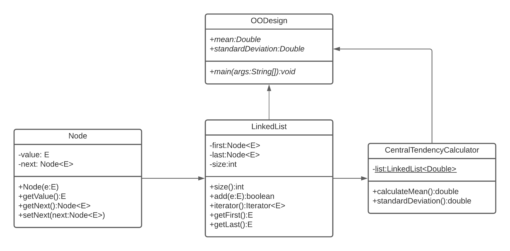
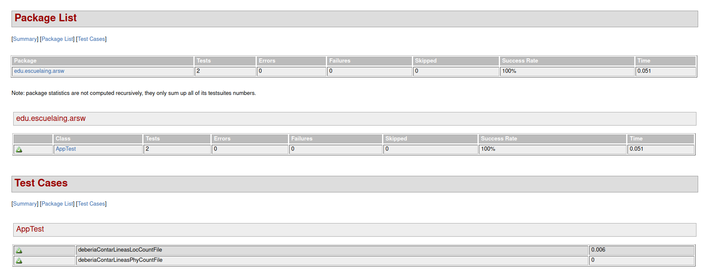

# OODesign

Aplicación que calcula la desviación estándar y la media de un conjunto de números encontrados en un archivo, esto se realizó por medio de la creación de una lista enlazada implementada desde 0.

## Instrucciones de uso
### Prerrequisitos
- git version 2.25.1
- Apache Maven version: 4.0.0
- java version: "1.8.0"

### Ejecución
Para poder usar el proyecto lo primero que se debe realizar es clonar el proyecto utilizando el siguiente comando desde una terminal:
```
git clone https://github.com/Desarik98/OODesign.git
```
Luego debe redirigirse por medio de la terminal al directorio en donde se clono el proyecto la cual contendrá el archivo pom.xml.
Una vez ubicado en este directorio se debe compilar el programa, para esto utilice el siguiente comando:
```
mvn package
```
Para finalizar utilice el comando para ejecutar el programa:
```
java -cp OODesign-1.0-SNAPSHOT.jar edu.escuelaing.arsw.OODesign ARCHIVO
```
Donde ARCHIVO es donde estará el conjunto de números a operar.

Un ejemplo de como ejecutarlo
```
java -cp OODesign-1.0-SNAPSHOT.jar edu.escuelaing.arsw.OODesign numbers.txt
```
## Diagrama de clases

Se crearon 4 clases: App, LinkedList usando tipos genéricos, Node usando tipos genéricos y CentralTendencyCalculator.

### App
En esta clase se encuentra el método **main** en donde se abrirá el archivo, guardará los números en la lista enlazada y retornara la media y la desviación estándar correspondiente.

### LinkedList
En esta clase se encuentra mi implementación propia de listas enlazadas que me servirán para enlazar los valores del archivo y poder operarlos.

### Node
Clase creadora de los nodos de la lista enlazada.

### CentralTendencyCalcualtor
Clase que hallará la media y la desviación estándar de la lista enlazada que contiene los números del archivo.

## Pruebas
Al ejecutar el comando **mvn package** se compila el programa y ejecuta las pruebas al mismo tiempo. Se prueba la funcionalidad del programa, validando que se cuenten las lineas de codigo de manera correcta con un archivo base. Se podrá encontrar la funcionalidad de estas pruebas en la carpeta TestReport dando click al archivo **surefire-report.html**


## Construccion
* [Maven](https://maven.apache.org/) - Dependency Management
* [Java](https://www.java.com/es/download/)
* [Git](https://github.com/) - Versionamiento
## Autor
* **Daniel Alejandro Mejía Rojas** - LOCS/h 121/3 = 40 LOCS/h - Fecha: 03/06/2021
## Licencia
This project is licensed under the MIT license - see the LICENSE.md file for details
